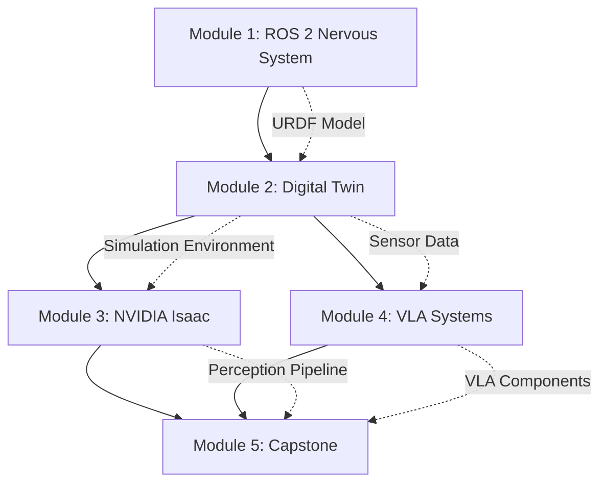

# Module Interfaces & Dependencies

**Project**: Embodied AI & Humanoid Robotics Book
**Branch**: `001-embodied-ai-book`
**Date**: 2025-12-19
**Phase**: Phase 1 - Contracts

## Module Dependency Graph



**Dependency Type Legend**:
- **Solid arrows** (→): Required prerequisite (must complete before starting)
- **Dotted arrows** (-.->): Artifact dependency (outputs used as inputs)

---

## Interface Specifications

### Module 1 → Module 2: Humanoid URDF Model

**Produced by Module 1**:
- **Artifact**: `simple_humanoid.urdf` (Unified Robot Description Format)
- **Location**: `embodied-ai-book-code/module1-ros2/examples/humanoid_urdf/`

**Contract Requirements**:
1. **Valid URDF XML**: Passes `check_urdf` validation tool
2. **Kinematic Completeness**: Contains all links and joints for humanoid (torso, head, 2 arms, 2 legs)
3. **Sensor Definitions**: Includes camera, LiDAR, IMU sensor plugins
4. **Inertial Properties**: Realistic mass, center of mass, inertia tensors for all links
5. **Collision Geometries**: Simplified collision shapes for physics simulation
6. **Visual Geometries**: Meshes or primitives for rendering

**Consumed by Module 2**:
- **Gazebo**: Convert URDF → SDF using `gz sdf -p simple_humanoid.urdf > simple_humanoid.sdf`
- **Unity**: Import URDF using Unity URDF Importer or ROS-TCP-Connector
- **Validation**: Robot loads without errors, joints articulate correctly

**Interface Validation**:
```bash
# Validate URDF
check_urdf simple_humanoid.urdf

# Expected output: "robot name is: simple_humanoid"
# "Successfully parsed urdf file"

# Test in Gazebo
ros2 launch gazebo_ros gazebo.launch.py
ros2 run gazebo_ros spawn_entity.py -entity simple_humanoid -file simple_humanoid.urdf
```

---

### Module 2 → Module 3: Digital Twin Environment

**Produced by Module 2**:
- **Gazebo Artifact**: `warehouse_world.sdf` (Gazebo world file with obstacles, objects, lighting)
- **Unity Artifact**: `WarehouseScene.unity` (Unity scene with imported humanoid and environment)
- **Sensor Data**: ROS 2 topics streaming simulated sensor data

**Contract Requirements**:
1. **Environment Complexity**: Indoor environment with obstacles (tables, shelves, walls) and manipulable objects
2. **Ground Plane**: Flat terrain with realistic friction (coefficient μ ≈ 0.8)
3. **Lighting**: Adequate lighting for camera simulation (ambient + directional)
4. **Object Placement**: 5-10 manipulable objects with known poses
5. **Sensor Activation**: All sensors publishing to ROS 2 topics at specified rates

**Consumed by Module 3**:
- **Isaac Sim**: Import environment USD or recreate based on Module 2 specifications
- **Nav2**: Use costmaps generated from environment for path planning
- **Perception**: RGB-D and LiDAR data used for SLAM and object detection

**Interface Validation**:
```bash
# Launch Gazebo environment
ros2 launch my_simulation warehouse.launch.py

# Verify sensor topics
ros2 topic list | grep -E '(camera|scan|imu)'

# Expected topics:
# /camera/image_raw
# /camera/depth
# /scan
# /imu/data
```

---

### Module 2 → Module 4: Sensor Data Streams

**Produced by Module 2**:
- **ROS 2 Topics**: `/camera/image_raw`, `/camera/depth`, `/scan`, `/imu/data`, `/joint_states`
- **Topic Types**: `sensor_msgs/Image`, `sensor_msgs/LaserScan`, `sensor_msgs/Imu`, `sensor_msgs/JointState`

**Contract Requirements**:
1. **Message Frequency**: Camera 30 Hz, LiDAR 10 Hz, IMU 100 Hz, Joint States 50 Hz
2. **Synchronized Timestamps**: All sensor messages use simulation time (`use_sim_time: true`)
3. **Coordinate Frames**: All sensor data uses appropriate TF frames (REP 105)
4. **Realistic Noise**: Sensors include realistic noise models (Gaussian for IMU, ray noise for LiDAR)

**Consumed by Module 4**:
- **Vision-Language Models**: Camera images used for object detection and scene understanding
- **Object Grounding**: Depth data used to localize objects in 3D space
- **IMU Data**: Used for robot orientation and state estimation

**Interface Validation**:
```bash
# Check message rates
ros2 topic hz /camera/image_raw
# Expected: average rate: 30.0

# Inspect message content
ros2 topic echo /imu/data --once
# Expected: Valid IMU data with linear_acceleration and angular_velocity
```

---

### Module 3 → Module 5: Perception Pipeline

**Produced by Module 3**:
- **Isaac ROS Nodes**: nvblox (3D mapping), cuVSLAM (localization), DOPE (object detection)
- **ROS 2 Topics**: `/nvblox/mesh`, `/visual_slam/tracking/odometry`, `/detections_3d`
- **Nav2 Stack**: Configured and tested for humanoid navigation

**Contract Requirements**:
1. **VSLAM Output**: 6-DOF pose estimates at 30 Hz with <1cm position error in simulation
2. **Object Detections**: 3D bounding boxes with object class, confidence score, 6-DOF pose
3. **Occupancy Map**: 3D voxel grid or 2D costmap for navigation
4. **Nav2 Integration**: Validated path planning and execution with bipedal constraints

**Consumed by Module 5 (Capstone)**:
- **Perception Data**: Object detections for manipulation planning
- **Localization**: VSLAM pose for navigation coordination
- **Occupancy Map**: Costmaps for collision-free path planning

**Interface Validation**:
```bash
# Launch Isaac ROS perception
ros2 launch isaac_ros_perception humanoid_perception.launch.py

# Verify perception topics
ros2 topic echo /detections_3d --once
# Expected: vision_msgs/Detection3DArray with object detections

# Check VSLAM output
ros2 topic hz /visual_slam/tracking/odometry
# Expected: ~30 Hz pose estimates
```

---

### Module 4 → Module 5: VLA Components

**Produced by Module 4**:
- **Whisper Node**: ROS 2 node publishing transcribed speech to `/speech_command`
- **LLM Planner Node**: Subscribes to `/speech_command`, publishes plans to `/task_plan`
- **Action Grounding Module**: Parses `/task_plan`, sends ROS 2 action goals
- **Vision-Language Models**: CLIP, LLaVA for object grounding

**Contract Requirements**:
1. **Speech Recognition**: >90% transcription accuracy, <2 second latency
2. **LLM Planning**: Structured JSON output with action sequence, <5% invalid command rate
3. **Action Grounding**: Correct translation of plans to ROS 2 actions (NavigateToPose, GraspObject, etc.)
4. **Object Grounding**: Language queries ("red box") → 3D object coordinates with >80% accuracy

**Consumed by Module 5 (Capstone)**:
- **Voice Interface**: Whisper node integrated into orchestrator
- **Cognitive Planner**: LLM planner for high-level task decomposition
- **Perception**: Vision-language grounding for object identification

**Interface Validation**:
```bash
# Test Whisper node
ros2 run whisper_ros2 speech_recognizer
# Speak command, verify transcription on /speech_command

# Test LLM planner
ros2 topic pub /speech_command std_msgs/String "data: 'pick up the red box'"
ros2 topic echo /task_plan --once
# Expected: JSON action plan

# Test action grounding
ros2 action send_goal /navigate_to nav2_msgs/action/NavigateToPose "..."
# Expected: Action accepted and executed
```

---

## Integration Points & Data Contracts

### End-to-End Data Flow (Capstone)

**Step 1: Speech Input → Transcription**
- **Input**: Audio stream (microphone or simulated)
- **Processing**: Whisper ASR
- **Output**: `/speech_command` (std_msgs/String) - "go to the table and pick up the red box"

**Step 2: Transcription → Task Planning**
- **Input**: `/speech_command` + scene context (object list, robot state)
- **Processing**: LLM planner (GPT-4/Qwen)
- **Output**: `/task_plan` (custom TaskPlan msg) - structured action sequence

**Step 3: Task Plan → Navigation Goal**
- **Input**: `/task_plan` (first step: "navigate_to table")
- **Processing**: Action grounding module
- **Output**: Nav2 action goal `/navigate_to_pose` (nav2_msgs/NavigateToPose)

**Step 4: Navigation → Localization Feedback**
- **Input**: Nav2 action feedback
- **Processing**: Navigation controller
- **Output**: `/odom` (nav_msgs/Odometry), `/amcl_pose` (geometry_msgs/PoseWithCovarianceStamped)

**Step 5: Object Detection → Grasp Planning**
- **Input**: `/camera/image_raw`, `/camera/depth`, language query "red box"
- **Processing**: CLIP/YOLO object detection, depth-based 3D localization
- **Output**: `/detected_objects` (vision_msgs/Detection3DArray) with 3D pose of "red box"

**Step 6: Grasp Execution → Manipulation**
- **Input**: Grasp action goal `/grasp_object` (custom action with object ID and pose)
- **Processing**: IK solver, trajectory planner, gripper controller
- **Output**: Grasp success/failure feedback

**Step 7: Task Completion → Status Report**
- **Input**: All action completion statuses
- **Processing**: Orchestrator state machine
- **Output**: `/task_status` (custom TaskStatus msg) - "Task completed successfully" or error message

---

## Dependency Management

### Python Dependencies (requirements.txt)

```
# ROS 2 Python client
rclpy>=3.3.0

# Computer Vision
opencv-python>=4.8.0
numpy>=1.24.0
pillow>=10.0.0

# Object Detection
ultralytics>=8.0.0  # YOLOv8

# LLM Integration
openai>=1.0.0  # GPT-4 API
transformers>=4.35.0  # Hugging Face models (Qwen, CLIP, LLaVA)
torch>=2.1.0  # PyTorch for local models

# Speech Recognition
openai-whisper>=20231117  # Local Whisper

# Utilities
pyyaml>=6.0
```

### ROS 2 Package Dependencies (package.xml)

```xml
<!-- Core ROS 2 -->
<depend>rclpy</depend>
<depend>std_msgs</depend>
<depend>sensor_msgs</depend>
<depend>geometry_msgs</depend>
<depend>nav_msgs</depend>

<!-- Navigation -->
<depend>nav2_msgs</depend>
<depend>nav2_bringup</depend>

<!-- Perception -->
<depend>vision_msgs</depend>
<depend>image_transport</depend>
<depend>cv_bridge</depend>

<!-- TF/Transforms -->
<depend>tf2_ros</depend>
<depend>tf2_geometry_msgs</depend>

<!-- Isaac ROS (Module 3) -->
<depend>isaac_ros_nvblox</depend>
<depend>isaac_ros_visual_slam</depend>
<depend>isaac_ros_dope</depend>
```

### System Dependencies (apt packages)

```bash
# ROS 2 Humble
sudo apt install ros-humble-desktop ros-humble-gazebo-ros-pkgs

# Navigation
sudo apt install ros-humble-navigation2 ros-humble-nav2-bringup

# Visualization
sudo apt install ros-humble-rviz2 ros-humble-rqt

# Development Tools
sudo apt install python3-colcon-common-extensions python3-rosdep

# Computer Vision
sudo apt install python3-opencv libopencv-dev
```

---

## Conclusion

All module interfaces, dependencies, and data contracts specified. Capstone integration well-defined with clear data flow from voice input to task completion.

**Ready for**: quickstart.md creation and task generation (/sp.tasks).
